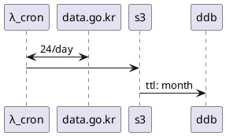

# 유기동물조회

## 흐름
```text
 ┌──────┐          ┌──────────┐          ┌──┐          ┌───┐
 │λ_cron│          │data.go.kr│          │s3│          │ddb│
 └──┬───┘          └────┬─────┘          └┬─┘          └─┬─┘
    │       24/day      │                 │              │  
    │ <─────────────────>                 │              │  
    │                   │                 │              │  
    │                   │                 │              │  
    │ ────────────────────────────────────>              │  
    │                   │                 │              │  
    │                   │                 │  ttl: month  │  
    │                   │                 │ ────────────>│  
 ┌──┴───┐          ┌────┴─────┐          ┌┴─┐          ┌─┴─┐
 │λ_cron│          │data.go.kr│          │s3│          │ddb│
 └──────┘          └──────────┘          └──┘          └───┘
```

<details>
<summary>수정</summary>
<a href="https://plantuml.com/ko/sequence-diagram">문법</a>
<a href="https://www.planttext.com">planttext.com</a>


</details>

## 검색 요구사항
**@todo**

## 데이터 소스
https://www.data.go.kr/dataset/15001096/openapi.do