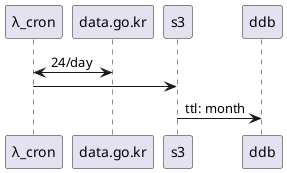

# 유기동물조회


## 흐름
```text
 ┌──────┐          ┌──────────┐          ┌──┐          ┌───┐
 │λ_cron│          │data.go.kr│          │s3│          │ddb│
 └──┬───┘          └────┬─────┘          └┬─┘          └─┬─┘
    │       24/day      │                 │              │  
    │ <─────────────────>                 │              │  
    │                   │                 │              │  
    │                   │                 │              │  
    │ ────────────────────────────────────>              │  
    │                   │                 │              │  
    │                   │                 │  ttl: month  │  
    │                   │                 │ ────────────>│  
 ┌──┴───┐          ┌────┴─────┐          ┌┴─┐          ┌─┴─┐
 │λ_cron│          │data.go.kr│          │s3│          │ddb│
 └──────┘          └──────────┘          └──┘          └───┘
```

- `ddb`: **검색 요구사항** 이 먼저 나온 후 결정

<details>
<summary>수정</summary>
<a href="https://plantuml.com/ko/sequence-diagram">문법</a>
<a href="https://www.planttext.com">planttext.com</a>


</details>

## 환경
### 개발
`yarn` **@필수**
```shell script
yarn add -D -W 개발디펜던시
yarn workspace @deptno/{패키지명} add 디펜던시 # 패키지명 예. aa_frontend
```
### 로컬 개발 환경
```shell script
yarn graphql # 백엔드
yarn next # 프론트엔드
```
### 파일명 컨벤션
카멜 케이스(camelCase)
### aws
```shell script
$ aws configure --profile aa                                                                       

AWS Access Key ID [None]: ********************
AWS Secret Access Key [None]: ****************************************
Default region name [None]: ap-northeast-2
Default output format [None]: json
```

## 테스트
[플레이그라운드](https://wlfoc30xcj.execute-api.ap-northeast-2.amazonaws.com/dev/graphql)

⚠️ 접속 후 URL 패스에 `dev` 가 빠져있는데 이를 추가해야 하므로 아래 주소를 붙여 넣는다.

`https://wlfoc30xcj.execute-api.ap-northeast-2.amazonaws.com/dev/graphql`

## Query
- [x] `aa`, 로우레벨 데이터 접근

## 데이터 소스
https://www.data.go.kr/dataset/15001096/openapi.do