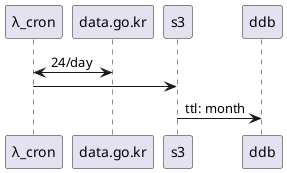

# 데이터레이크

## 크롤링

```text
 ┌──────┐          ┌──────────┐          ┌──┐          ┌───┐
 │λ_cron│          │data.go.kr│          │s3│          │ddb│
 └──┬───┘          └────┬─────┘          └┬─┘          └─┬─┘
    │       24/day      │                 │              │  
    │ <─────────────────>                 │              │  
    │                   │                 │              │  
    │                   │                 │              │  
    │ ────────────────────────────────────>              │  
    │                   │                 │              │  
    │                   │                 │  ttl: month  │  
    │                   │                 │ ────────────>│  
 ┌──┴───┐          ┌────┴─────┐          ┌┴─┐          ┌─┴─┐
 │λ_cron│          │data.go.kr│          │s3│          │ddb│
 └──────┘          └──────────┘          └──┘          └───┘
```

- `ddb`: **검색 요구사항** 이 먼저 나온 후 결정

<details>
<summary>수정</summary>
<a href="https://plantuml.com/ko/sequence-diagram">문법</a>
<a href="https://www.planttext.com">planttext.com</a>


</details>

최초 계획은 S3 에 먼저 저장하는 것 이었으나 데이터 업데이트가 실시간으로 되는 것을 확인함.  
시간단위로 데이터를 가져와서 다이나모디비에 저장 후 일정기간마다 s3 에 백업하는 방법으로 한다.


